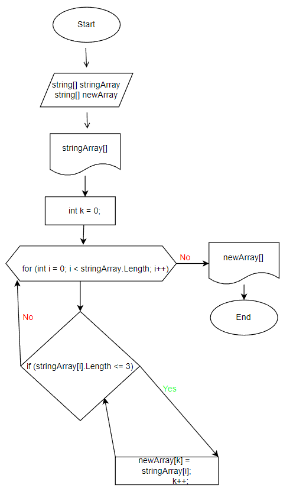

# Нужно написать программу, которая из имеющегося массива строк формирует массив из строк, длина которых меньше либо равна 3 символа




## 1. Намолняем массив строками 
(задаём на старте выполнения алгоритма)
```
string[] stringArray = new string[4];
stringArray[0] = "1234";
stringArray[1] = "1567";
stringArray[2] = "-2";
stringArray[3] = "computer science";
```
## 2. Выводим на эркан наполненный массив 

```
Console.WriteLine($"stringArray: {stringArray[0]}, {stringArray[1]}, {stringArray[2]}, {stringArray[3]}");
```
## 3. Сортируем массив
метод:
```
string[] ArraySort(string[] array)
```

## 4. Выводим на экран отсортированный массив
метод:
```
void PrintArray(string[] inputArray)
```

